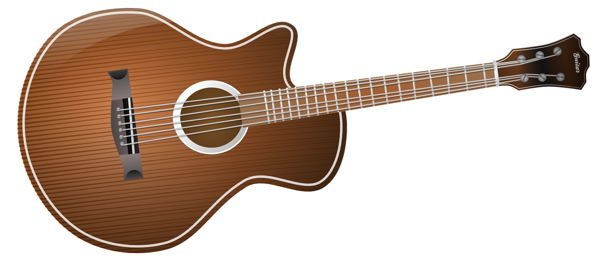

## Guitar Store (Java Application)

# This is a Software designing project: 
### 1. OOAD (Object oriented Analysis and Design) Usage 
### 2. Noun Analysis / Verb Analysis
### 3. OOPS CONCEPTS / Less redundant code
### 4. UML Analysis / Requirement Engineering

